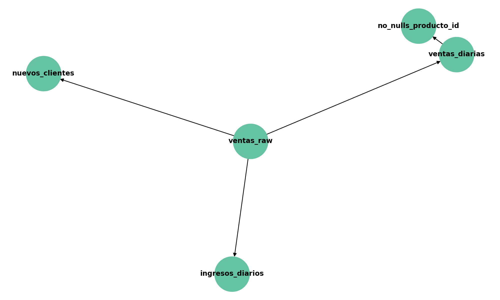

# 📊 Proyecto de Modelado de Datos con Dataform (Local)

Este proyecto simula un flujo de transformación de datos en **Dataform CLI** de forma local, usando SQL modular, assertions de calidad y estructuras por capas tipo **bronze/silver/gold**.



## Tecnologías usadas
- Node.js + NPM
- Dataform CLI
- SQL modular
- Ejecutado en local con PowerShell

## Estructura del proyecto

- ventas_raw.sqlx: Datos crudos
- ventas_diarias.sqlx: Agregación diaria
- ingresos_diarios.sqlx: KPIs de negocio
- nuevos_clientes.sqlx: Modelo incremental
- no_nulls_producto_id.sqlx: Assertion de calidad

## Cómo correrlo

```bash
npm install
npx dataform compile
npx dataform run --dry-run